

# 2018级项目实训成果展示 

## 《教你轻松用手机》 -  HTML5与移动互联网开发方向

###  项目简介

> 教你轻松用手机

​		近年来随着互联网时代的到来，智能手机成了我们生活中必不可少的重要部分。但是智能手机的更新迭代速度过快，导致大部分对新鲜事物学习能力较弱的中老年人无法便捷地使用智能手机过多的 APP 及其功能。另外，由于年轻人的生活节奏变快，中老年人在不会用手机 APP 的情况很难找到合适的时间与年轻人沟通学习。为解决这一痛点，我们开发了“教你轻松用手机”微信小程序，以帮助中老年人越过数字鸿沟。

### 项目地址

- Gitee：[https://gitee.com/zhao_jiann/ELife](https://gitee.com/zhao_jiann/ELife)

### 项目成员

- 赵健（项目经理，系统架构师）
  - Email：[862494272@qq.com](mailto:862494272@qq.com) 
  - Github：[https://github.com/zhoajiann](https://github.com/zhoajiann)
- 陈欣（后端开发工程师，UI设计师）
  - Email：[1013450070@qq.com](mailto:1013450070@qq.com)
  - Github：[https://github.com/chenxin1101](https://github.com/chenxin1101)
- 李宁（后端开发工程师，数据库管理员）
  - Email：[1656759947@qq.com](mailto:1656759947@qq.com) 
  - Github：[https://github.com/jasmynaa  ](https://github.com/jasmynaa  )
- 王若冰（前端开发工程师，测试工程师）
  - Email：[wangruobingbing@sina.com](mailto:wangruobingbing@sina.com)
  - Github：[https://github.com/WRB-bing](https://github.com/WRB-bing)
- 卢冰（前端开发工程师，运维工程师）
  - Email：[907499926@qq.com](mailto:907499926@qq.com)
  - Github：[https://github.com/xiaolansong](https://github.com/xiaolansong)

### 项目截图

  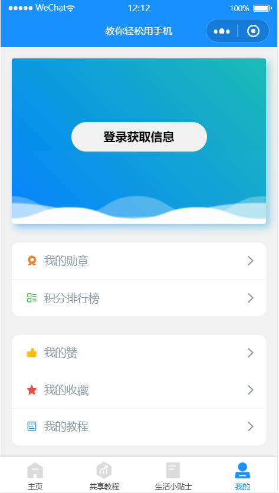
  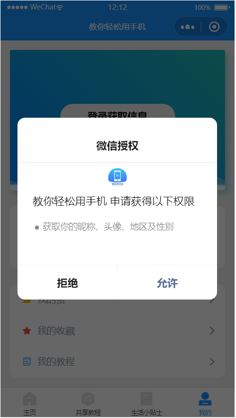
  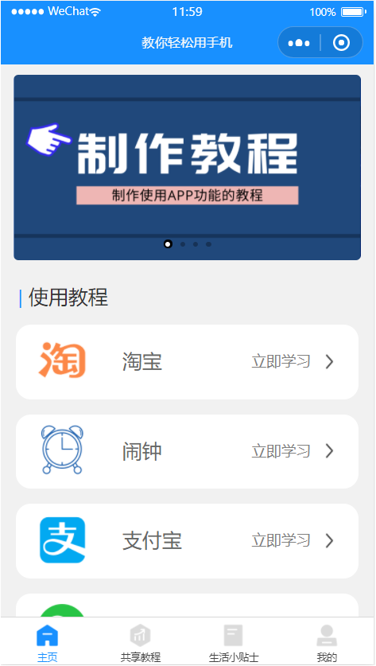

  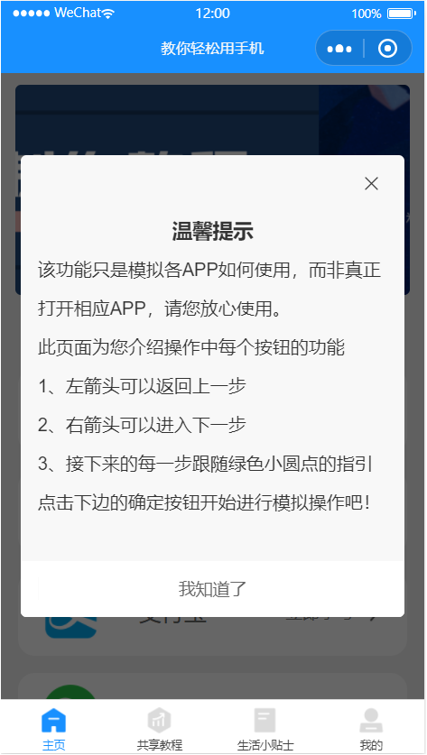
  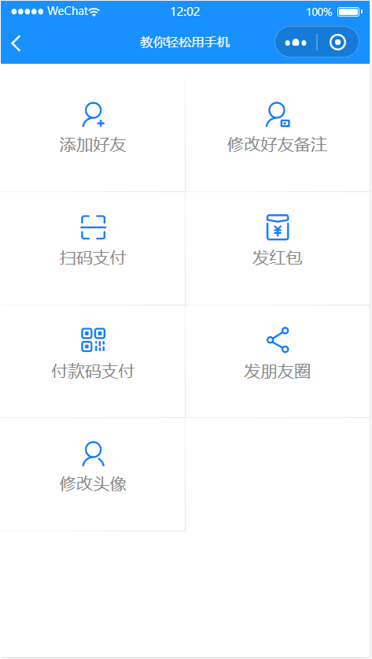
  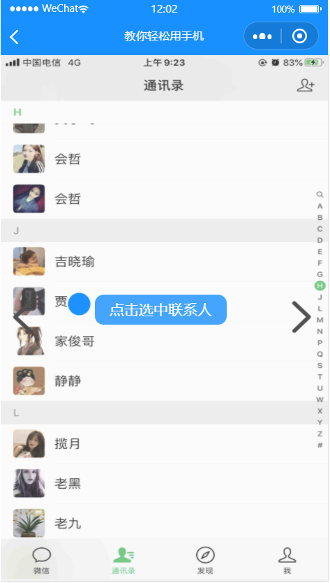

  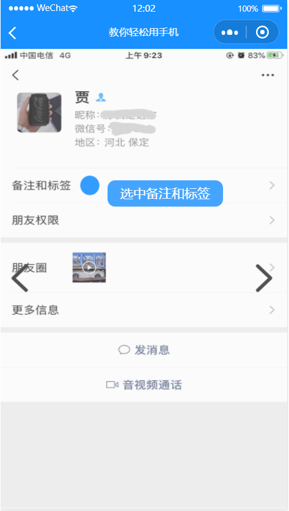
  
  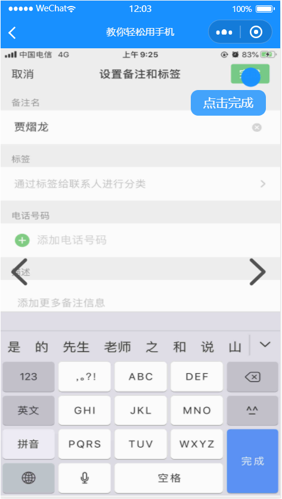

  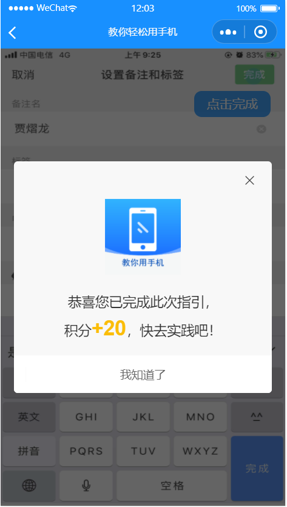
  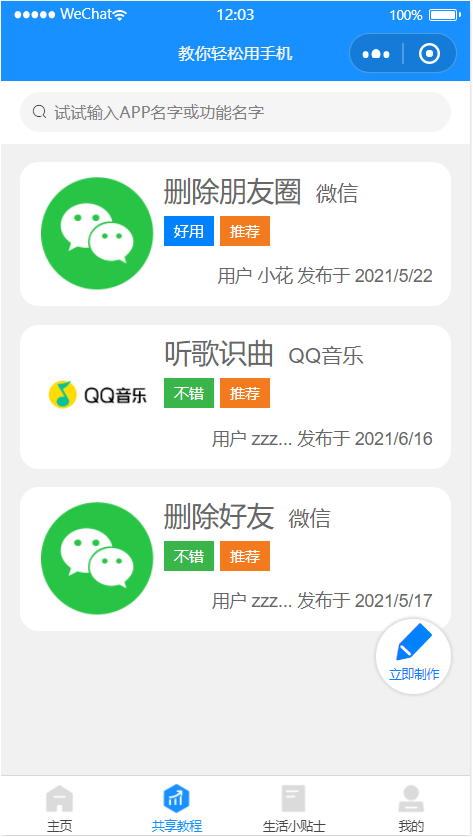
  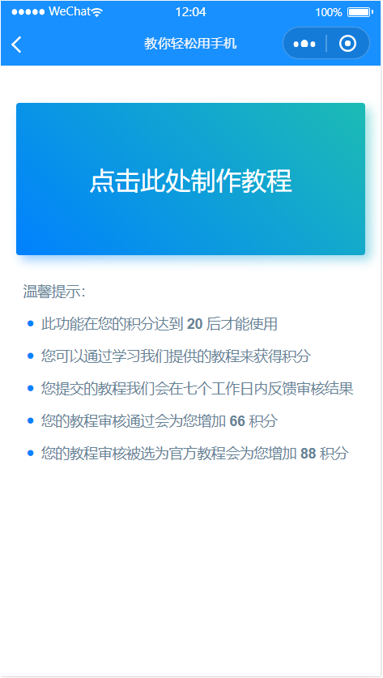

  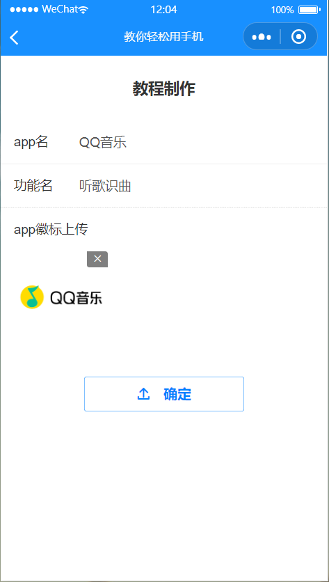
  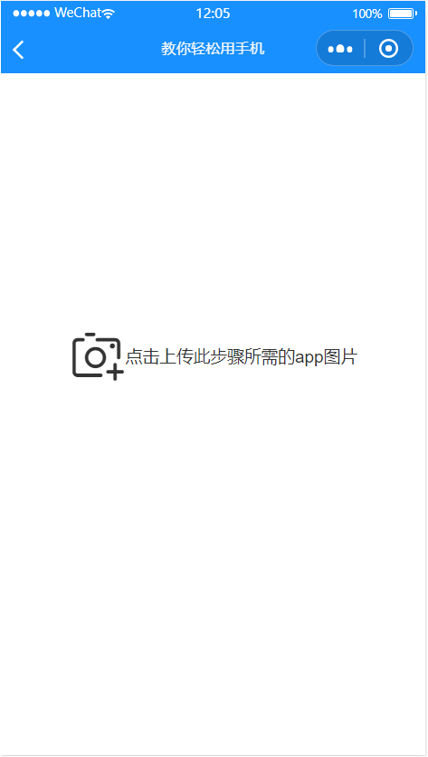
  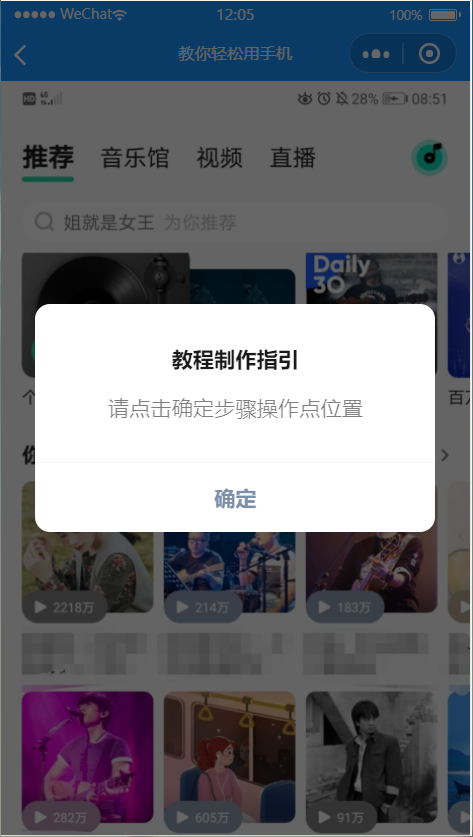

  
  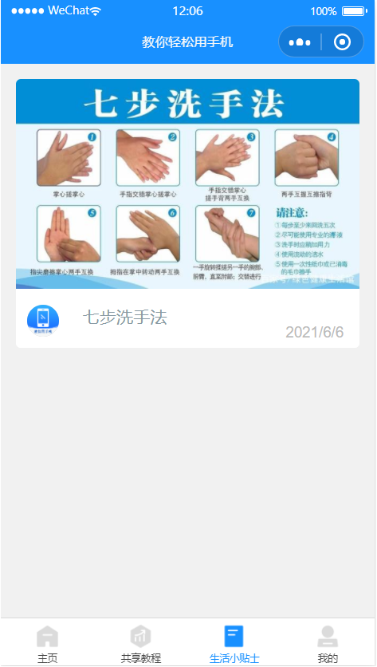
  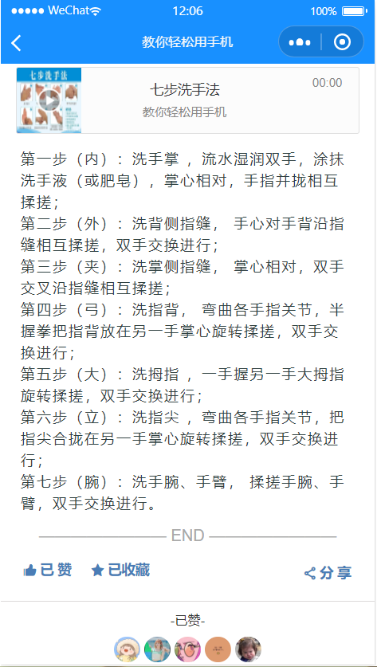

  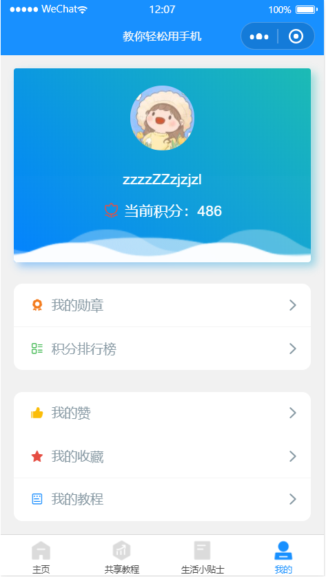
  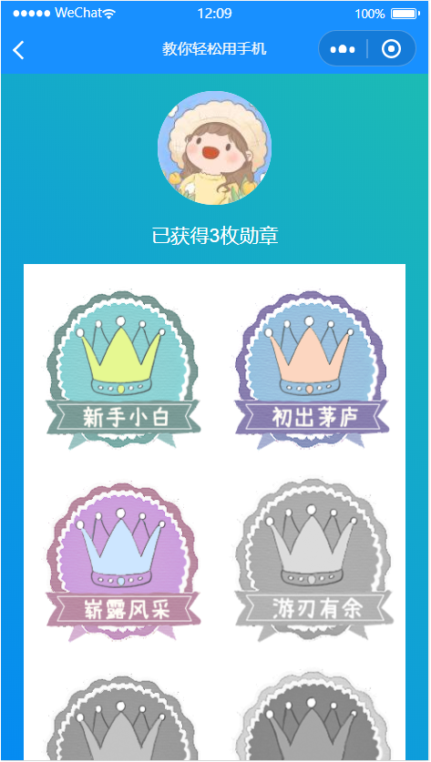
  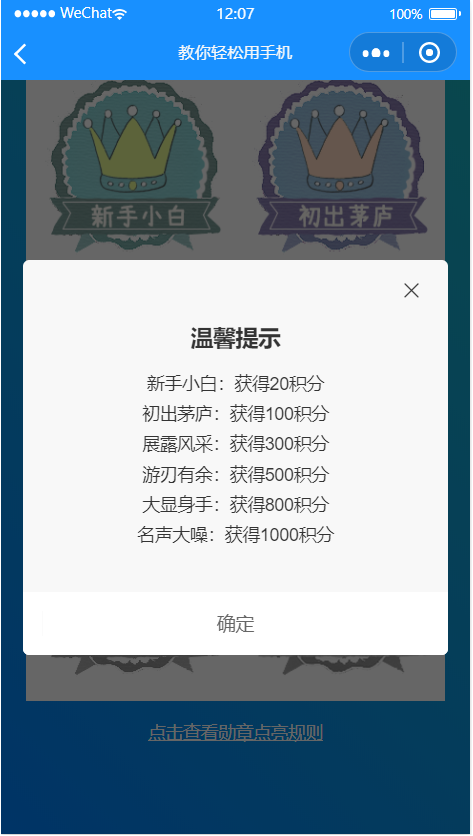

  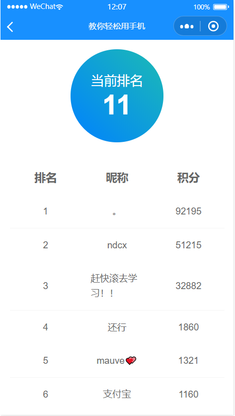
  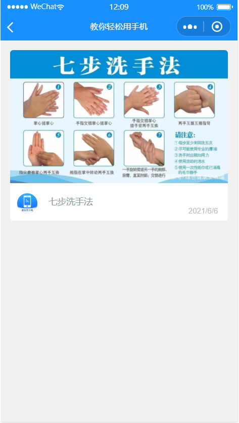
  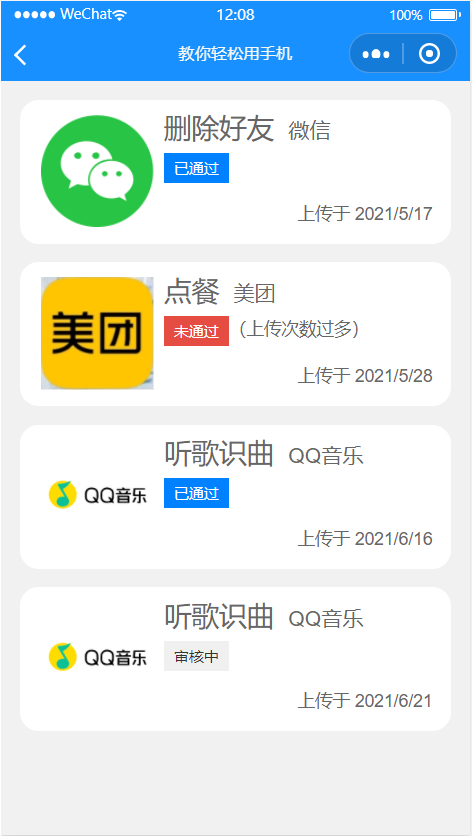

  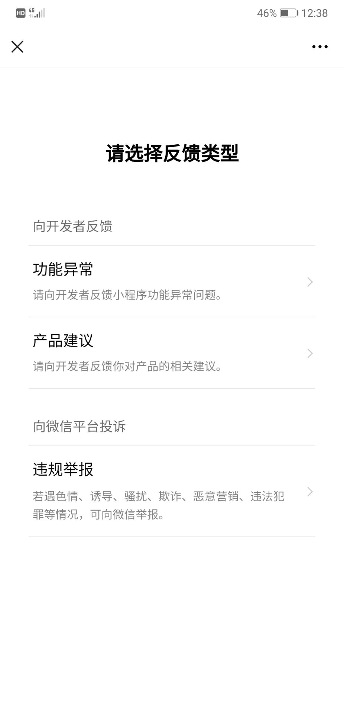
  

