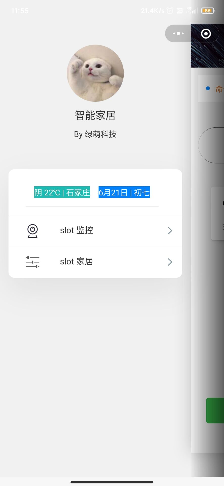
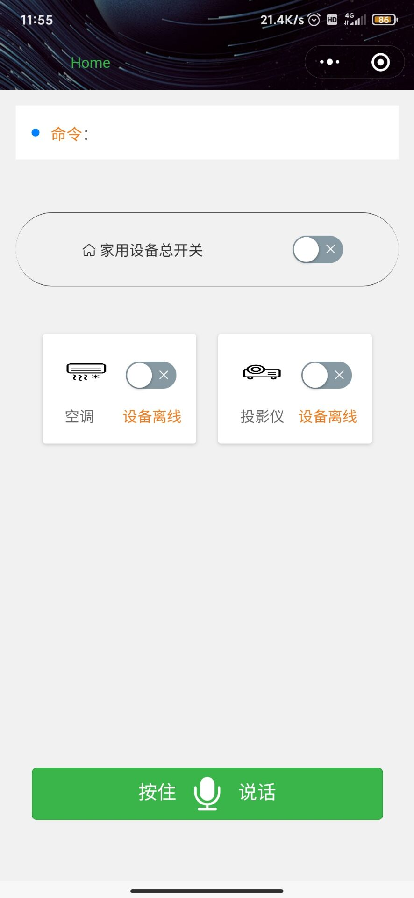
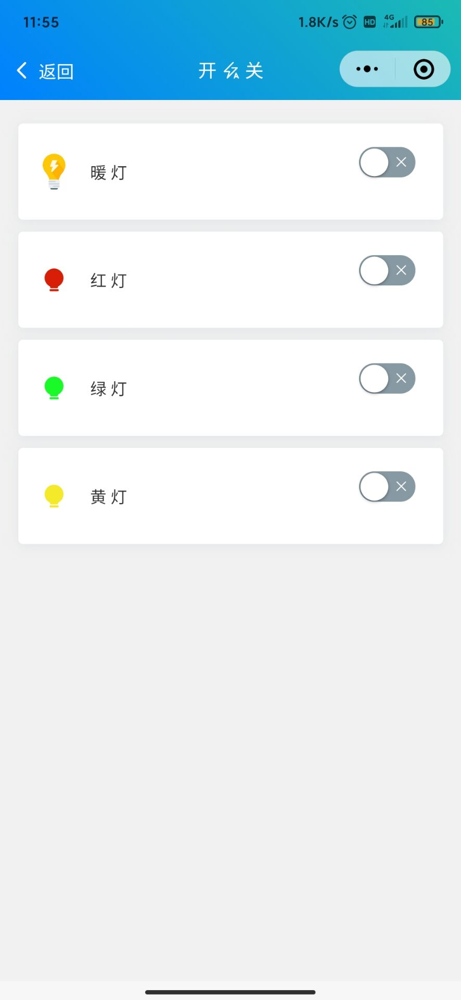



# 2018级项目实训成果展示 

## 《智家安全大脑》 - 人工智能方向

###  项目简介

> 智家安全大脑——让智慧走进每一个家庭。

我们的项目是基于家庭微计算机作为“智慧大脑”，以人工智能深度学习算法模型为载体，所拓展实现的集智能家居控制和智能家庭安防等为一体化的、多场景的“智慧家庭管家”式服务。 

### 项目成员

- 叶烁（项目经理）
  
  - Email：[Jovan_Ye@126.com](mailto:2381620795@qq.com) 
- 王亚奇（开发工程师）

  Email：[759836398@qq.com]
- 李建民（UI前端设计开发工程师）
  
  - Email：[1796887546@qq.com]
- 赵彤（测试工程师）
  
  - Email：[927117666@qq.com]

### 项目截图

  
  
  

